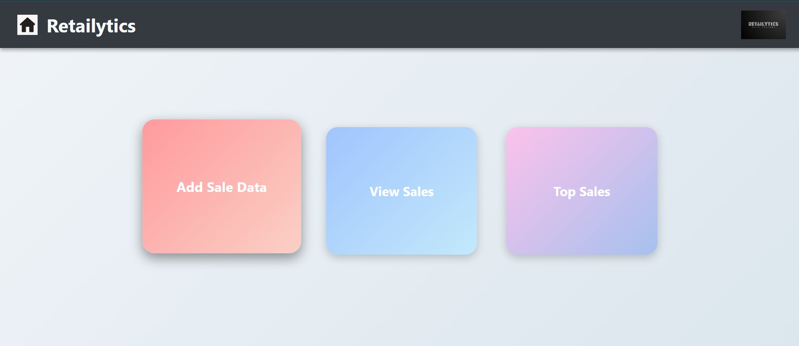
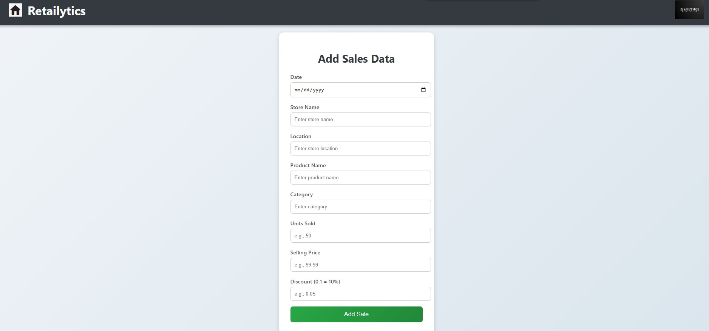
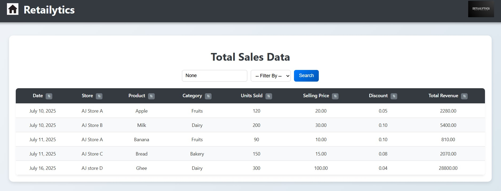
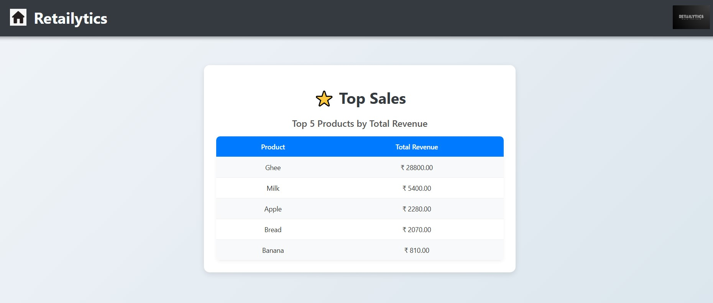

# Retailytics – Retail Sales Analytics Platform


---

## 📌 Overview

Retailytics is an **end-to-end retail sales analytics platform** built with **Python, Django, and MySQL**.  
It simulates a **real-world data engineering workflow** by:

✔ **Collecting & storing sales data**  
✔ **Filtering & sorting by store, product, category, and date**  
✔ **Identifying top-selling products**  
✔ **Tracking profit & loss trends**  
✔ **Generating CSV, Excel, and PDF reports**

---

## 🖼 Screenshots

(Add screenshots after running the app)

- **Main Dashboard**  


- **Add Sales Data**  


- **Total Sales Table with Filters**  


- **Top Sales Analysis**  


- **Profit & Loss Dashboard (SOON!!!)**  

---

## 🚀 Features

✅ Add sales data with auto revenue calculation  
✅ Filter, search & sort sales data dynamically  
✅ Top 5 products by total revenue  
✅ Profit/Loss tracking with color-coded results  
✅ Clean, responsive UI
 Download reports in **CSV, Excel & PDF** formats  (SOON)


---

## 🛠 Tech Stack

| **Technology** | **Purpose** |
|-----------------|-------------|
| **Python (Django)** | Backend logic & web framework |
| **MySQL** | Structured sales data storage |
| **Pandas & OpenPyXL** | CSV & Excel |
| **ReportLab** | PDF report generation(Upcoming) |
| **HTML, CSS, JavaScript** | Frontend UI interactivity |

---

## ⚡ Setup Instructions

### ✅ 1. Clone Repository
```bash
git clone https://github.com/your-username/Retailytics.git
cd Retailytics
```

### ✅ 2. Install Dependencies and migrate to app folder
```bash
pip install -r requirements.txt
cd retail_analytics
```

### ✅ 3. Create MySQL Database
Run this in your MySQL terminal:
```sql
CREATE DATABASE retail_sales;
```

### ✅ 4. Update Database Settings in Django (`settings.py`)
```python
DATABASES = {
    'default': {
        'ENGINE': 'django.db.backends.mysql',
        'NAME': 'retail_sales',
        'USER': 'root',
        'PASSWORD': 'your_password',
        'HOST': 'localhost',
        'PORT': '3306',
        'OPTIONS': {
            'init_command': "SET sql_mode='STRICT_TRANS_TABLES'"
        }
    }
}
```

*(Change `USER` & `PASSWORD` as per your system credentials.)*

### ✅ 5. Run Migrations
```bash
python manage.py makemigrations
python manage.py migrate
```

### ✅ 6. Start the Server
```bash
python manage.py runserver
```
Open in browser:  
`http://127.0.0.1:8000/`

---
### For sample data use data provided
*(Data from sales_data.csv and run etl_scrpts)*
```bash 
cd retailytics/etl_scripts
python etl.py
```

---

## 🎯 Business Value

- Helps **retail managers** monitor performance & profitability  
- Useful for **data analysts** generating sales reports  
- Foundation for **future ML models** (sales forecasting & trends)

---

## 🔮 Future Enhancements

✔ Automated Data Entry
✔ Profit/Loss calculator
✔ Interactive charts (Top Products, Profit vs Loss trends)  
✔ Store-wise dashboards  
✔ Role-based authentication  
✔ Deployment on cloud (Azure/AWS)

---

## 🙋 Author

**Asim Jasim**  
📧 asimbc04@gmail.com 
